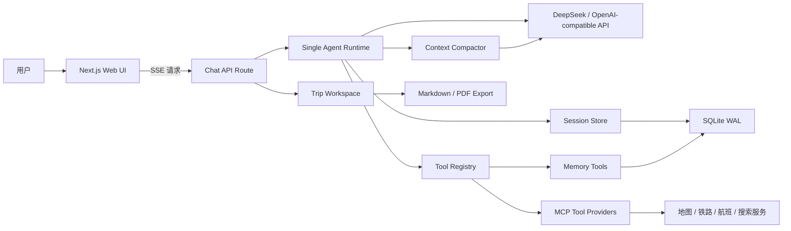

# TripMate

> 一个面向真实旅行规划场景的单 Agent 智能应用，基于 DeepSeek、MCP、Next.js 与 SQLite 构建。

TripMate 不只是一个聊天机器人。它会在多轮对话中理解用户的出发地、目的地、日期、预算、同行人和旅行偏好，自主判断何时调用外部工具，并将天气、交通、地图、航班与目的地信息组织成可持续编辑、保存和导出的结构化行程。

这是我的 AI 应用方向作品集项目。项目覆盖了从 Agent Runtime、工具协议、上下文管理、可靠性设计到全栈产品界面的完整实现，重点探索如何将大模型能力落地为一个可用、可维护、可扩展的产品。

## 项目亮点

- **单 Agent 推理循环**：模型在同一个运行循环中完成需求理解、工具选择、结果整合和最终回答。
- **实时流式交互**：基于 OpenAI-compatible Streaming API 与 SSE，将文本、工具调用、工具结果和 Token 用量实时推送到前端。
- **MCP 工具生态**：支持 stdio、Streamable HTTP 和 SSE 三种 MCP 传输方式，可扩展地图、铁路、航班、搜索等旅行服务。
- **并行工具执行**：同一轮产生的多个工具调用通过 `Promise.all` 并行执行，减少多数据源查询的等待时间。
- **工具可靠性保护**：内置超时、指数退避重试、熔断器和工具安全等级，避免单个外部服务拖垮整个 Agent。
- **长期记忆**：Agent 可以保存、召回和删除用户的稳定偏好，并在新会话开始时注入记忆快照。
- **长对话压缩**：上下文达到阈值后，使用快速模型将早期对话压缩为结构化摘要，同时保留最近消息原文。
- **结构化行程工作区**：聊天结果可以抽取为版本化的 `TripWorkspace`，用于展示每日行程、费用、地点与待确认问题。
- **本地持久化**：使用 SQLite WAL 模式保存会话、用户偏好、长期记忆和行程数据。
- **行程导出**：支持 Markdown 预览以及带中文字体的 PDF 行程文件导出。
- **可观测性**：记录模型延迟、Token 消耗、Prompt Cache 命中、工具延迟、错误率与预估成本。
- **完整 Web 产品界面**：三栏全屏工作台包含历史会话、Agent 对话区、MCP 实时状态和行程概览。

## 界面设计

TripMate 使用面向生产力工具的三栏布局：

- 左侧用于创建、搜索和切换历史行程。
- 中间是 Agent 对话、快捷提示、流式活动时间线与输入区。
- 右侧展示 MCP 工具连接状态、地图预览和结构化行程统计。

整体视觉采用黑白灰作为产品主色，绿色、橙色和红色仅用于表达成功、处理中和异常三种状态，保证界面克制且信息层级清晰。

## 核心技术栈

| 层级 | 技术 | 用途 |
| --- | --- | --- |
| 前端框架 | Next.js 15、React 18、TypeScript | App Router、服务端 API 与交互界面 |
| UI 与状态 | Tailwind CSS、Zustand | 响应式布局、组件样式和客户端状态管理 |
| Markdown | React Markdown、remark-gfm | 渲染 Agent 返回的结构化内容 |
| LLM | DeepSeek、OpenAI Node SDK | OpenAI-compatible 对话、流式输出和工具调用 |
| Agent Runtime | TypeScript AsyncGenerator | 驱动多轮推理、事件流和工具执行循环 |
| 工具协议 | Model Context Protocol SDK | 接入 stdio、HTTP 与 SSE MCP Server |
| 数据存储 | SQLite、better-sqlite3 | 会话、偏好、记忆和工作区持久化 |
| 文档导出 | PDFKit | 生成可下载的中文 PDF 行程 |
| 工程工具 | TypeScript、ESM、PostCSS | 类型约束、模块化构建与样式处理 |

## 系统架构



## Agent 工作流程

1. 用户发送旅行需求，API Route 创建或恢复对应会话。
2. Runtime 将系统提示、长期记忆、用户偏好、行程工作区和历史消息组合为模型上下文。
3. DeepSeek 以流式方式返回文本或 Function Tool Calls。
4. Tool Registry 根据工具名称路由到内置工具或 MCP Provider。
5. 多个只读工具并行执行，并经过超时、重试和熔断保护。
6. 工具结果写回对话上下文，Agent 继续推理，直到生成最终回答或达到最大迭代次数。
7. 文本、工具事件、耗时和 Token 用量通过 SSE 实时发送到前端。
8. 会话、工作区和记忆被持久化到 SQLite；长对话在后台异步压缩。

## 核心工程设计

### 1. 单 Agent Runtime

核心循环位于 `src/agent/runtime.ts`。它通过 `AsyncGenerator<TurnEvent>` 暴露统一事件流，使 CLI、Web API 或其他客户端可以复用同一套 Agent 能力。

Runtime 会处理以下事件：

- `text`：模型生成的增量文本。
- `tool_call`：模型发起的工具调用。
- `tool_result`：工具执行结果、错误与延迟。
- `usage`：模型、Token、缓存命中和请求耗时。
- `done`：本轮结束原因。

这种事件驱动结构把 Agent 逻辑与界面解耦，前端不需要理解模型供应商的原始响应格式。

### 2. MCP 工具层

`MCPToolProvider` 将 MCP Server 统一适配为项目内部的 `ToolProvider` 接口，并支持：

- stdio 本地进程通信。
- Streamable HTTP 远程服务。
- SSE 兼容服务。
- 工具名称自动添加 Provider 前缀，避免多个服务之间发生命名冲突。
- 连接、列举工具、调用工具与关闭连接的完整生命周期。

当前运行时配置包含铁路、地图、搜索、旅行内容和航班相关 MCP 服务。新增服务只需要提供配置并注册到 `ToolRegistry`，无需修改 Agent 主循环。

### 3. 工具可靠性与安全边界

`ToolRegistry` 不只是工具列表，它承担了 Agent 与外部系统之间的可靠性边界：

- 默认 30 秒调用超时。
- 针对瞬时错误执行指数退避重试。
- 按 Provider 维护熔断状态。
- 熔断打开时从模型可见工具列表中暂时隐藏不可用工具。
- 根据 `read`、`write`、`idempotent_write` 安全等级决定最大重试次数。
- 统一收集工具延迟和失败指标。

### 4. 记忆与上下文管理

长期记忆使用独立的 Memory Tool Provider 实现。Agent 可以保存饮食禁忌、交通偏好、酒店档次等稳定信息，而不会把单次旅行日期或临时天气写入长期记忆。

每个会话启动时会生成固定的记忆快照。这样既能保持个性化，也能让请求前缀在多轮对话中保持稳定，从而提高 DeepSeek Prompt Cache 的命中率。

当上下文超过 Token 阈值时，`Compactor` 会使用快速模型将早期消息压缩为 JSON 摘要，保留：

- 用户硬性约束。
- 用户偏好。
- 已确认决策。
- 工具查询结论。
- 尚未解决的问题。

压缩过程在后台执行，不阻塞当前回答。

### 5. 数据持久化

`SessionStore` 使用接口隔离业务逻辑与存储实现，当前默认后端为 SQLite：

- `sessions`：会话消息、标题、约束、行程和压缩状态。
- `preferences`：用户默认出发城市、货币、节奏、酒店档次等设置。
- `memories`：可被 Agent 管理的长期用户记忆。

SQLite 开启 WAL 与 `synchronous=NORMAL`，在本地开发和单机部署中兼顾读写性能与数据可靠性。未来可以在不改动 Agent Runtime 的情况下替换为 PostgreSQL、Redis 或其他后端。

### 6. 结构化行程与导出

旅行规划不是只保留在聊天文本中。项目定义了版本化的领域模型，包括：

- 旅行约束与用户偏好。
- 每日城市、日期和行程项目。
- 预算与费用统计。
- 待确认问题和人工修改字段。

对话内容可以抽取为 `TripWorkspace`，在右侧工作区中持续同步，并进一步导出为 Markdown 或 PDF。

## 项目目录

```text
app/
  api/                         Next.js API Routes
  globals.css                  全局样式与主题
components/
  ChatUI.tsx                   三栏主界面与交互编排
  tripmate/                    会话、输入、工作区与弹窗组件
lib/
  agent-singleton.ts           Web Runtime 组装与 MCP 注册
src/
  agent/                       Agent 循环与事件类型
  llm/                         OpenAI-compatible LLM Client
  tools/                       MCP、工具注册、健康检查与记忆工具
  session/                     会话存储、SQLite、记忆与上下文压缩
  export/                      Markdown 与 PDF 导出
  domain.ts                    旅行领域模型
  workspace.ts                 结构化工作区转换
  observability.ts             日志、指标与成本估算
assets/
  fonts/                       PDF 中文字体资源
```

## 本地运行

### 环境要求

- Node.js 20+
- npm
- DeepSeek API Key

### 安装与启动

```bash
git clone <your-repository-url>
cd tripmate-agent
npm install
cp .env.example .env
```

在 `.env` 中配置：

```env
DEEPSEEK_API_KEY=your-key-here
DEEPSEEK_BASE_URL=https://api.deepseek.com
MAIN_MODEL=deepseek-v4-pro
FAST_MODEL=deepseek-v4-flash
LOG_LEVEL=info
```

编译 Agent Runtime 并启动 Web 应用：

```bash
npm run build
npm run dev:web
```

浏览器访问 `http://localhost:3000`。

如果只想调试 Agent CLI：

```bash
npm run dev
```

### 可选运行配置

```env
# 自定义 SQLite 文件路径
TRIPMATE_DB=/path/to/tripmate.sqlite

# 本地开发时跳过外部 MCP 连接
TRIPMATE_SKIP_MCP=1
```

请勿将包含真实 API Key 的 `.env` 文件提交到 GitHub。

## 常用命令

| 命令 | 说明 |
| --- | --- |
| `npm run dev:web` | 启动 Next.js 开发服务器 |
| `npm run build:web` | 构建 Web 应用 |
| `npm run start:web` | 启动 Web 生产构建 |
| `npm run dev` | 启动 Agent CLI |
| `npm run build` | 编译 Agent Runtime |
| `npm run typecheck` | 执行 TypeScript 类型检查 |

## API 能力

项目通过 Next.js Route Handlers 提供以下核心能力：

- 流式 Agent 对话。
- 会话创建、查询、重命名与删除。
- 用户偏好读取与保存。
- 长期记忆查询与删除。
- 行程工作区读取、保存与内容抽取。
- Markdown 预览与 PDF 导出。
- MCP 服务状态、工具数量与运行指标查询。

## 作品集价值

这个项目集中展示了以下能力：

- 将大模型 Function Calling 设计为可维护的 Agent Runtime。
- 使用 MCP 将模型与真实外部服务解耦。
- 处理流式输出、长上下文、持久化和多轮状态等 AI 产品工程问题。
- 为不稳定的外部工具建立超时、重试和熔断机制。
- 从领域模型出发，把自然语言结果转化为可编辑和可导出的产品数据。
- 独立完成从系统架构、后端能力到 Web 交互与视觉设计的全栈实现。

## 后续计划

- 增加行程预算、时间冲突和地理距离的自动校验。
- 增加地图路线的真实可视化与拖拽式行程编辑。
- 为工具结果增加可配置缓存，进一步降低延迟和调用成本。
- 增加单元测试、Agent 评测集与端到端回归测试。
- 增加 PostgreSQL 后端与容器化部署方案。
- 增加公开 Demo、产品截图和演示视频。

---

如果你正在评估这个项目，建议优先阅读：

- `src/agent/runtime.ts`：单 Agent 核心循环。
- `src/tools/registry.ts`：工具可靠性与调用治理。
- `src/tools/mcp.ts`：MCP 多传输协议适配。
- `src/session/compactor.ts`：长上下文压缩。
- `src/session/sqlite-backend.ts`：会话、偏好与记忆持久化。
- `components/ChatUI.tsx`：Web 产品界面的状态与交互编排。
